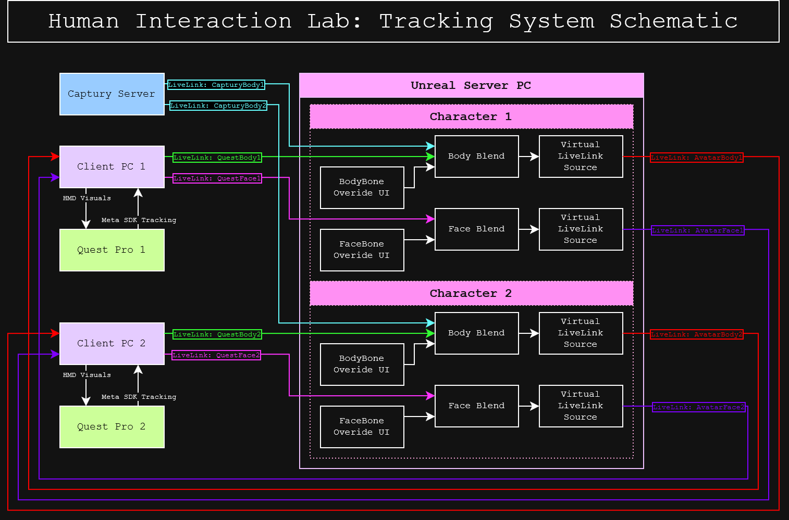

# Captury & MetaQuestPro VR interaction system

The system installed in room 4.05 contains many moving parts to create the interaction system. This document serves to explain the purpose of each component and instruct on how to operate the system for the purpose of academic experimentation.

The full length document can be found [in this PDF](manual/HILSystem.pdf).

## General explanation of the components
- Captury Machine: This machine is responsible for capturing the physical movements of the participants. It uses a series of cameras and sensors to track the movements and stream the data to the UE5 Server.
- UE5 Server: This server is responsible for processing the data from the Captury machine and sending it to the client machines. It runs the Unreal Engine 5 software and hosts the virtual environment.
- Client Machines: These machines are used to run the Unreal Engine 5 client software and display the virtual environment to the participants. They receive the processed data from the UE5 Server and use it to control the avatars in the virtual space.
- Networking Equipment: This includes routers, switches, and other networking devices that are used to connect all the machines together and allow them to communicate.
- Meta Quest Pro Headsets: These are the virtual reality headsets used by the participants to experience the virtual environment. They connect to the client machines and receive the video feed from the UE5 Server.
\end{itemize}

# Diagrams
## Data Flow Diagram

## System Circuit Diagram

## Network Diagram
